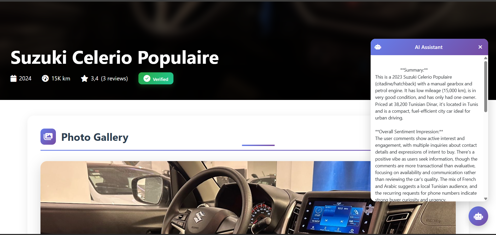

# 🚗 GoWheels
## 📚 Table of Contents

- [🚗 Overview](#-gowheels)
- [🧠 Key Features](#-key-features)
- [🐳 Docker Deployment](#-docker-deployment-no-repository-cloning-required)
- [📦 Installation Steps](#-step-1--download-docker-composeprodyml)
- [🌍 Access the Application](#-access-the-application)
- [🧱 Architecture](#-docker-architecture)
- [👤 Default Accounts](#-default-accounts)
- [🤖 AI Assistant](#-ai-assistant)
- [🛠 Management Commands](#-management-commands)
- [🧪 Development Mode](#-development-mode-optional)
- [🔐 Security Notes](#-security-notes)
- [🎓 Academic Highlights](#-academic-highlights)
- [🏗 Tech Stack](#-tech-stack)
- [✅ Conclusion](#-conclusion)


### Vehicle Listings & Review Platform – .NET 8 + Docker + AI Integration
<p align="center">
  
</p>
GoWheels is a full-stack vehicle marketplace platform built with **ASP.NET Core (.NET 8)**, **PostgreSQL**, **MongoDB**, and **Docker**.

The platform allows users to:

* Browse vehicle listings
* Post and manage vehicles
* Leave reviews and ratings
* View AI-powered summaries and sentiment analysis of comments
* Authenticate with role-based access (Admin / Expert / User)

---

# 🧠 Key Features

* 🔐 ASP.NET Identity authentication & roles
* ⭐ Rating system (Users & Posts)
* 🗂 PostgreSQL relational database
* 🪞 MongoDB mirror (NoSQL read optimization)
* 🤖 AI Assistant (OpenRouter LLM integration)
* 🐳 Fully containerized with Docker
* 🚀 One-command deployment

---

# 🐳 Docker Deployment (No Repository Cloning Required)

This project can be launched using **only Docker and docker-compose**, without cloning or building the source code.

---

## ✅ Prerequisites

* Docker installed
  👉 [https://docs.docker.com/get-docker/](https://docs.docker.com/get-docker/)

Verify installation:

```bash
docker --version
docker compose version
```

---

# 📦 Step 1 — Download docker-compose.prod.yml

Download the deployment file:

```bash
curl -O https://raw.githubusercontent.com/AmrDroid-git/GoWheelsWebsite/master/docker-compose.prod.yml
```

Or download manually from GitHub.

> The repository does NOT need to be cloned.

---

# 📦 Step 2 — Launch the Application

Run the application using:

```bash
OPENROUTER_API_KEY=your_api_key_here docker compose -f docker-compose.prod.yml up -d
```

⏳ First startup may take 30–60 seconds while PostgreSQL initializes.

---

# 🌍 Access the Application

Open your browser:

```
http://localhost:8080
```

---

# 🧱 Docker Architecture

The system launches three containers:

| Service             | Description                       |
| ------------------- | --------------------------------- |
| `gowheels_app`      | ASP.NET Core (.NET 8) application |
| `gowheels_postgres` | PostgreSQL 15 database            |
| `gowheels_mongo`    | MongoDB 7 (NoSQL mirror)          |

### Persistent Volumes

* PostgreSQL data
* MongoDB data
* ASP.NET DataProtection keys

---

# 👤 Default Accounts

| Role   | Email                                                 | Password     |
| ------ | ----------------------------------------------------- | ------------ |
| Admin  | [admin@gowheels.local](mailto:admin@gowheels.local)   | Password123! |
| Expert | [expert@gowheels.local](mailto:expert@gowheels.local) | Password123! |
| User   | [user@gowheels.local](mailto:user@gowheels.local)     | Password123! |

---

# 🤖 AI Assistant

Each vehicle page includes an AI Assistant bubble that:

* Summarizes the vehicle listing
* Analyzes overall sentiment of user comments
* Provides buying tips
* Uses an external LLM via OpenRouter API

The API key must be provided at runtime:

```bash
OPENROUTER_API_KEY=your_key_here docker compose up -d
```

---

# 🛠 Management Commands

Stop application:

```bash
docker compose down
```

Full cleanup (removes database data):

```bash
docker compose down -v
```

View logs:

```bash
docker logs gowheels_app
```

List running containers:

```bash
docker ps
```

---

# 🧪 Development Mode (Optional)

If you want to run locally without Docker:

```bash
dotnet restore
dotnet run --project GoWheels
```

App URL:

```
http://localhost:5237
```

---

# 🔄 Database Reset Behavior

By default in production:

```
DatabaseSettings__RemakeDatabase=false
```

To force a full reset & reseed:

```
DatabaseSettings__RemakeDatabase=true
```

---

# 🔐 Security Notes

* API keys are injected via environment variables
* Database credentials are defined for academic/demo purposes
* In production, secrets should be externalized

---

# 🎓 Academic Highlights

- Clean architecture (Services, Interceptors, DbContext)
- Hybrid SQL + NoSQL architecture
- AI integration (LLM-based summarization & sentiment analysis)
- Containerized infrastructure
- Reproducible deployment
- Role-based authentication
- JSONB usage in PostgreSQL
- EF Core migrations & seeding

---

# 🏗 Tech Stack

* ASP.NET Core 8
* Entity Framework Core
* PostgreSQL 15
* MongoDB 7
* Docker & Docker Compose
* OpenRouter API (LLM)
* jQuery + Razor Views

---

# ✅ Conclusion

GoWheels demonstrates a modern full-stack architecture combining:

* Relational data consistency
* NoSQL read optimization
* AI-powered user experience
* Containerized reproducible deployment

The application can be launched with a single command and requires no manual configuration.

---
